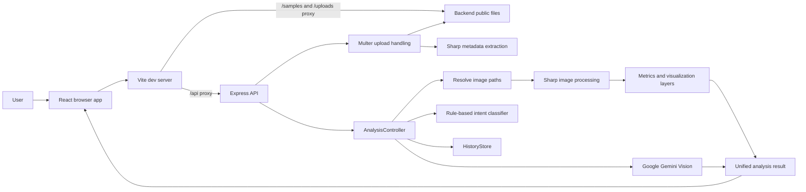

# SatQuery AI

SatQuery AI is a satellite-image analysis application. A user can load a prepared satellite scene, upload an image, or compare two images. The user writes a natural-language question, and the application combines local image algorithms with Google Gemini Vision analysis.

## What The Application Does

- Loads prepared satellite examples such as water, vegetation, SAR, and urban scenes.
- Uploads JPG, PNG, WebP, and TIFF images.
- Analyzes one image, a before/after pair, or optical plus SAR imagery.
- Detects water, vegetation, urban areas, land cover, objects, flooding, and change.
- Shows image layers, metrics, findings, explanations, and history.
- Uses Gemini Vision when configured.
- Falls back to local algorithmic analysis when Gemini is unavailable.

## Architecture



## How It Works

### 1. The browser starts

The frontend is a React application served by Vite. The main UI is assembled in `frontend/src/App.tsx`.

On startup, the browser requests:

- `GET /api/samples`
- `GET /api/history`
- `GET /api/config/status`

It then loads the first sample into the workspace.

### 2. The user chooses an image

There are three input modes:

- **Single optical:** one primary image.
- **Dual temporal:** before and after images.
- **Optical + SAR:** an optical image and a radar image.

For an uploaded image, the browser sends multipart form data to `POST /api/upload`. The backend:

1. Checks the extension and MIME type.
2. Limits the file to 50 MB.
3. Saves it under `backend/public/uploads`.
4. Uses Sharp to read dimensions, format, and channel count.
5. Creates image metadata and returns a public URL such as `/uploads/sat_...jpg`.

### 3. The user writes a question

The browser sends a JSON request to `POST /api/query`:

```json
{
  "query": "Show water bodies and delta river channels",
  "images": {
    "primary": {
      "path": "/path/to/image.jpg",
      "url": "/uploads/image.jpg"
    }
  }
}
```

For prepared data, the request can use a sample ID instead:

```json
{
  "query": "What changed between the two images?",
  "sampleId": "sample_bengaluru_temporal"
}
```

### 4. The backend selects an analysis intent

`AIService.classifyIntent()` reads the question and image roles. It selects an intent such as:

- `WATER_DETECTION`
- `VEGETATION_ANALYSIS`
- `CHANGE_DETECTION`
- `SAR_ANALYSIS`
- `URBAN_AREA_DETECTION`
- `LAND_COVER_CLASSIFICATION`
- `FLOOD_ANALYSIS`
- `IMAGE_DESCRIPTION`

A dual-image request automatically becomes change detection. An image in the SAR role automatically enables SAR analysis.

### 5. Local image processing runs

`ImageProcessingService` uses Sharp to read raw pixels and calculate metrics. Depending on the intent, it creates masks, heatmaps, comparison layers, histograms, and land-cover breakdowns.

Examples of calculations used by the application include:

- VARI as an RGB vegetation approximation.
- Water and spectral color thresholds.
- Pixel differences for temporal change.
- Texture and brightness signals for urban areas.
- Backscatter and roughness signals for SAR-style analysis.

This local step works without an AI key.

### 6. Gemini Vision optionally runs

If `GEMINI_API_KEY` is configured, the backend sends Gemini:

- The uploaded or sample image as base64 image data.
- The natural-language query.
- The detected intent.
- The local algorithm metrics.
- The image metadata.

Gemini returns structured JSON containing a summary, explanation, confidence, recommended visualization, and findings.

The final result uses `sourceType: "HYBRID_AI_ALGO"` when Gemini succeeds. If the request fails, the application logs the reason and returns a transparent local response with `sourceType: "DEMO_FALLBACK"`.

## Technologies Used

### Frontend

- **React 18:** component-based user interface.
- **TypeScript:** static types for components, API data, and analysis results.
- **Vite:** development server and production bundler.
- **Tailwind CSS:** utility-based styling.
- **Lucide React:** interface icons.
- **Recharts:** metrics and chart visualizations.
- **Fetch API:** browser-to-backend requests.

### Backend

- **Node.js:** JavaScript runtime.
- **Express:** HTTP server and API routing.
- **TypeScript:** typed backend code.
- **Multer:** multipart image upload handling.
- **Sharp:** image metadata, pixel reading, and image processing.
- **Google Generative AI SDK:** Gemini Vision requests.
- **dotenv:** environment configuration.
- **UUID:** unique analysis IDs.
- **CORS:** development access between frontend and backend.

### Storage

The current application uses the local filesystem:

- Generated samples: `backend/public/samples`
- Uploaded images: `backend/public/uploads`
- Analysis history: handled by `backend/src/services/historyStore.ts`

There is no database in the current version.

## Important Files

```text
frontend/src/App.tsx                       Main application state and screens
frontend/src/services/api.ts               Browser API client
frontend/src/components/upload/            Upload UI
frontend/src/components/viewer/            Image viewer and layers
frontend/src/components/copilot/            Natural-language query UI

backend/src/server.ts                      Express startup and static files
backend/src/routes/api.ts                  API route definitions
backend/src/controllers/analysisController.ts
                                            Upload and analysis orchestration
backend/src/services/aiService.ts          Intent detection and Gemini integration
backend/src/services/imageProcessing.ts    Local image algorithms
backend/src/services/sampleDataService.ts  Sample definitions and image generation
backend/src/services/geoMetadata.ts        Image metadata extraction
backend/src/services/historyStore.ts       Local analysis history
```

## Setup And Run

### Requirements

- Node.js 18 or newer.
- npm.
- Optional: a Google AI Studio Gemini API key.

### Environment

The root `.env` file contains:

```env
PORT=5001
GEMINI_API_KEY=your_key_here
VITE_API_URL=http://localhost:5001
```

The backend explicitly loads the root `.env` file, even when it is started from the `backend` directory.

### Install dependencies

```bash
npm install
npm install --prefix backend
npm install --prefix frontend
```

### Start both applications

From the project root:

```bash
npm run dev
```

The usual URLs are:

- Frontend: `http://localhost:5173`
- Backend: `http://localhost:5001`

If port 5173 is already in use, Vite chooses another port, such as 5174.

### Build

```bash
npm run build --prefix backend
npm run build --prefix frontend
```

## API Endpoints

| Method | Endpoint | Purpose |
|---|---|---|
| `GET` | `/api/health` | Backend health check |
| `GET` | `/api/config/status` | Gemini and demo-mode status |
| `GET` | `/api/samples` | Prepared sample datasets |
| `POST` | `/api/upload` | Upload one or more images |
| `POST` | `/api/query` | Run natural-language analysis |
| `GET` | `/api/history` | List previous analyses |
| `GET` | `/api/history/:id` | Read one analysis |
| `DELETE` | `/api/history/:id` | Delete one analysis |
| `POST` | `/api/config/test-api-key` | Test a Gemini key |

Shortcut analysis endpoints are also available:

- `POST /api/analyze/water`
- `POST /api/analyze/vegetation`
- `POST /api/analyze/change-detection`
- `POST /api/analyze/urban`
- `POST /api/analyze/sar`
- `POST /api/analyze/landcover`

## Gemini And Free Demo Mode

The app has two operating modes:

### Live AI mode

Set a valid Google AI Studio key in the root `.env` file:

```env
GEMINI_API_KEY=your_real_key
```

Restart the backend after changing `.env`. The config endpoint should report:

```json
{
  "demoMode": false,
  "apiConfigured": true
}
```

### Demo mode

When the key is missing or the provider request fails, local algorithms still run. The result is marked as `DEMO_FALLBACK` so it is clear that Gemini did not produce the explanation.

## Troubleshooting

### Images are not loading

1. Confirm the backend is running on port 5001.
2. Open `http://localhost:5001/api/health`.
3. Test a sample directly, for example:
   `http://localhost:5001/samples/sundarbans_sentinel2.jpg`
4. Start the frontend through Vite so `/samples`, `/uploads`, and `/api` are proxied to the backend.

### AI is showing demo fallback

1. Confirm `GEMINI_API_KEY` is not empty.
2. Confirm the key is in the root `.env`, not only in `frontend/.env`.
3. Restart the backend after editing `.env`.
4. Check `GET /api/config/status`.
5. Check the backend terminal for the provider error.

### Port 5001 is already in use

Find the process:

```bash
lsof -nP -iTCP:5001 -sTCP:LISTEN
```

Stop it, then start the backend again.

### Frontend API requests fail

Use the Vite development URL, not a file opened directly from disk. The frontend uses relative requests such as `/api/query`, and Vite proxies them to the backend.

## Typical Request Flow Summary

```text
User opens app
  -> Vite serves React
  -> React loads samples, history, and AI status
  -> User selects or uploads image
  -> Backend saves image and extracts metadata
  -> User writes a question
  -> Backend classifies intent
  -> Sharp calculates local image metrics
  -> Gemini optionally explains the metrics and image
  -> Backend combines metrics, layers, and findings
  -> React renders the result and saves it to history
```
